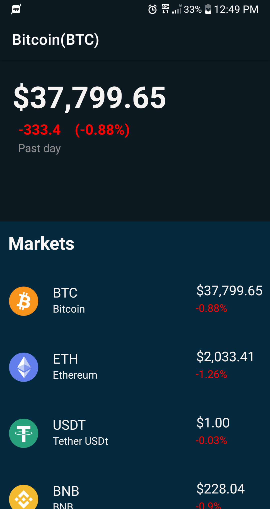
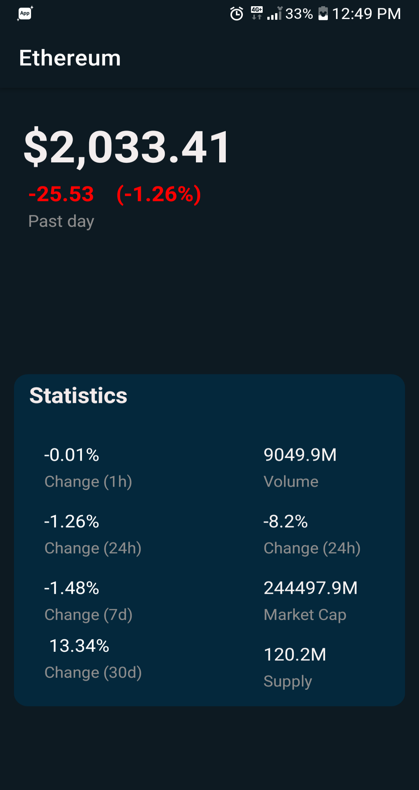

## CryptoTracker Android App

CryptoTracker is an Android application that allows users to track the latest market data for Bitcoin and other cryptocurrencies. The app makes API calls to fetch real-time price and market information and stores the data locally using Room Database. Users can view the data within the app for better insights into the cryptocurrency market.

## Features

- **Real-time Data**: The app fetches real-time data for Bitcoin and other cryptocurrencies from a public API.

- **Local Storage**: Data is stored locally in a Room Database for offline access and improved performance.

- **User-Friendly Interface**: Intuitive interface for users to easily navigate and view cryptocurrency market information.

## Getting Started

### Prerequisites

- Android Studio
- Android SDK
- Java Development Kit (JDK)

### Installation

1. Clone the repository:
   ```bash
   git clone https://github.com/Ahmad-Zaman-Khan/CryptoTracker.git
   
2. Open the project in Android Studio.
3. Build and run the app on an emulator or physical device.

### Technologies Used

- Android Studio
- Java
- XML
- Room Database
- Retrofit

### API Used

The app fetches cryptocurrency data from the Coinmarketcap API.

## Screenshots






[//]: # (![Screenshot 1]&#40;Screenshot1.png&#41;)

[//]: # (![Screenshot 2]&#40;Screenshot2.png&#41;)
